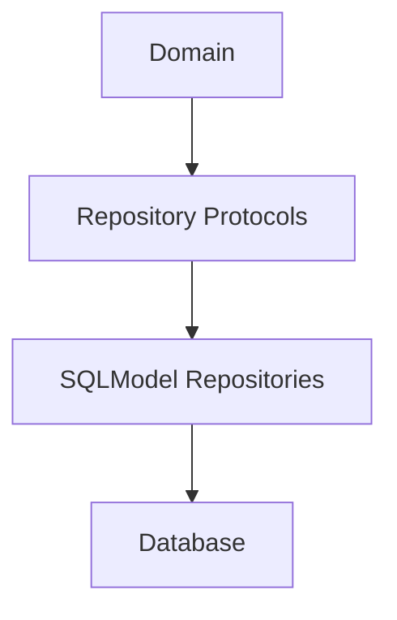

# Wave 2B M2 Persistence Architecture

## Clean Architecture Boundary

## Notes
- Domain entities remain SQLModel-independent.
- Repository protocols are unchanged from Milestone 1.
- SQLModel entities are persistence-only structures.
- Mapping functions perform explicit bidirectional conversion.
- Migration sequence is additive and preserves Wave 2A.3 and M1 behavior.
