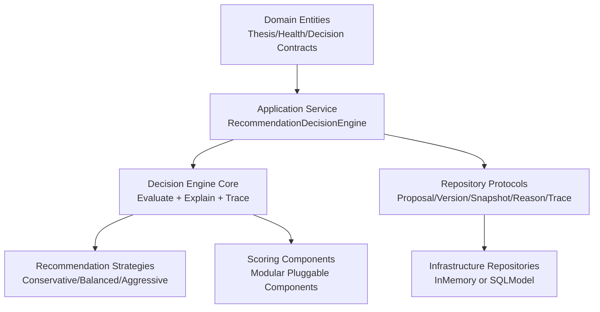
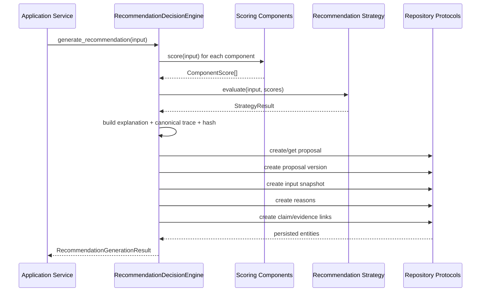

# Wave 2B M3 Decision Engine Architecture

## Scope
Milestone 3 implements deterministic recommendation scoring and strategy orchestration without changing domain contracts, repository protocols, or persistence boundaries.

## Layering

## Recommendation Flow
1. Receive deterministic input bundle (thesis health, claims, evidence, interpretations, portfolio context).
2. Execute scoring components independently.
3. Resolve selected strategy and combine component outputs.
4. Produce recommendation action, score, confidence, priority, review flag.
5. Build explanation object (drivers, warnings, confidence label).
6. Build canonical trace payload and hash.
7. Persist proposal version, snapshot, reasons, claim links, and evidence links through existing protocols.

## Class Diagram

```mermaid
classDiagram
    class RecommendationDecisionEngine {
      +evaluate(input) RecommendationEvaluation
      +generate_recommendation(input) RecommendationGenerationResult
    }

    class RecommendationEngineInput {
      +proposal_id
      +target_type
      +target_key
      +thesis_version_id
      +strategy_key
      +portfolio_context
    }

    class ScoringComponent {
      <<interface>>
      +score(input) ComponentScore
    }

    class WeightedRecommendationStrategy {
      +evaluate(input, scores) StrategyResult
    }

    class RecommendationExplanation {
      +recommendation
      +overall_score
      +drivers
      +warnings
    }

    class RecommendationDecisionTrace {
      +input_hash
      +canonical_payload_json
      +applied_rules
      +final_score
    }

    class RecommendationProposalRepositoryProtocol {
      <<interface>>
      +create(proposal)
      +get(proposal_id)
    }

    class RecommendationProposalVersionRepositoryProtocol {
      <<interface>>
      +create(version)
      +get_latest(proposal_id)
    }

    class RecommendationSnapshotRepositoryProtocol {
      <<interface>>
      +create(snapshot)
    }

    class RecommendationReasonRepositoryProtocol {
      <<interface>>
      +create_many(reasons)
    }

    class RecommendationTraceRepositoryProtocol {
      <<interface>>
      +create_claim_links(links)
      +create_evidence_links(links)
    }

    RecommendationDecisionEngine --> RecommendationEngineInput
    RecommendationDecisionEngine --> ScoringComponent
    RecommendationDecisionEngine --> WeightedRecommendationStrategy
    RecommendationDecisionEngine --> RecommendationExplanation
    RecommendationDecisionEngine --> RecommendationDecisionTrace
    RecommendationDecisionEngine --> RecommendationProposalRepositoryProtocol
    RecommendationDecisionEngine --> RecommendationProposalVersionRepositoryProtocol
    RecommendationDecisionEngine --> RecommendationSnapshotRepositoryProtocol
    RecommendationDecisionEngine --> RecommendationReasonRepositoryProtocol
    RecommendationDecisionEngine --> RecommendationTraceRepositoryProtocol
```

## Sequence Diagram

## Scoring Framework
Implemented components:
- Health Score
- Confidence Score
- Evidence Quality Score
- Evidence Freshness Score
- Contradiction Penalty
- Portfolio Alignment Score
- Risk Penalty
- Opportunity Bonus

Design notes:
- Each component is independently testable.
- Component values are bounded to [0, 1].
- Components declare orientation (benefit or penalty).
- Strategy consumes component output with configurable weights.

## Strategy Framework
Implemented strategies:
- conservative-v1
- balanced-v1
- aggressive-v1

Design notes:
- One shared weighted strategy implementation; no duplicated algorithm.
- Strategy-specific thresholds control action mapping and review strictness.
- Strategy-specific weights control relative influence of components.

## Explainability Design
Each generated recommendation includes:
- Recommendation action.
- Overall score (0-100).
- Top drivers.
- Warnings from elevated penalties.
- Confidence label.
- Strategy identifier.
- Component breakdown with contribution values.

## Deterministic Trace and Replay
The engine stores deterministic trace artifacts in canonical JSON:
- Inputs (sorted, normalized).
- Intermediate component scores.
- Applied rules.
- Strategy output.
- Confidence breakdown.
- Explanation.
- Engine version and timestamp.

A SHA-256 hash of the canonical payload is persisted as the input hash.

## Extension Guide
To add a new scoring component:
1. Implement ScoringComponent.
2. Register it in engine construction or default_scoring_components().
3. Add component weight to strategies.
4. Add unit tests for component behavior.

To add a new strategy:
1. Define a new WeightedRecommendationStrategy profile.
2. Register in default_recommendation_strategies().
3. Add strategy tests for score/action/review behavior.

Potential future adapters (without engine redesign):
- LLM-based scoring adapters.
- Bayesian score components.
- ML model score components.
- External API enrichment components.
- Agentic rationale generators.

## Guardrail Compliance
This milestone does not implement:
- portfolio optimization
- relationship engine
- opportunity engine beyond deterministic placeholder signal
- LLM reasoning
- autonomous agents
- realtime streaming
- frontend concerns
