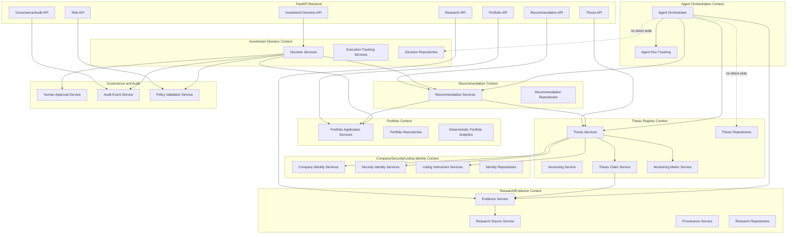

# PIIOS Component Architecture (C4 Level 3)

Date: 2026-07-26

## Component map

## Component constraints
- Portfolio logic remains in Portfolio context.
- Thesis context references portfolio snapshots through IDs and query interfaces only.
- Recommendation and Investment Decision are separate bounded contexts.
- Agent orchestration is read/propose; mutation requires deterministic services + approval gates.
