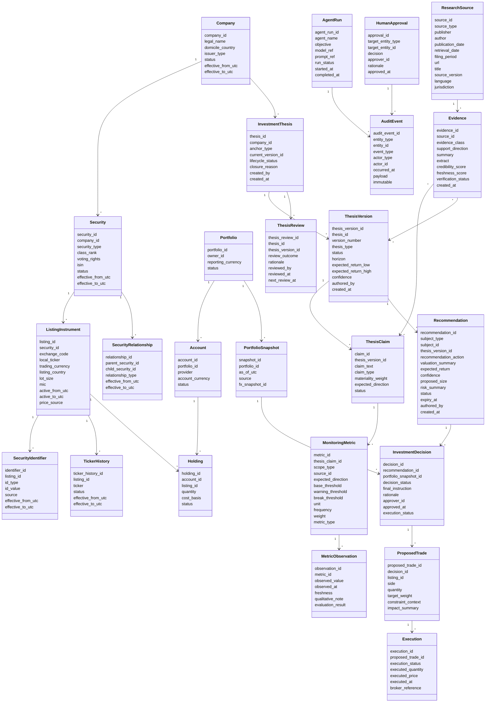

# PIIOS Domain Model Blueprint

Date: 2026-07-26

## Core domain model

## Relationship rules

| Relationship | Cardinality | Ownership | Lifecycle dependency | Deletion behavior | Audit requirement |
|---|---|---|---|---|---|
| Company -> Security | 1 to many | Identity context | Security depends on company | Soft-delete company only after no active securities | Required |
| Security -> ListingInstrument | 1 to many | Identity context | Listing depends on security | Listing inactive effective-dated; no hard delete | Required |
| ListingInstrument -> Holding | 1 to many | Portfolio context reference | Holding references listing | Holdings immutable via snapshots; soft close position | Required |
| InvestmentThesis -> ThesisVersion | 1 to many | Thesis context | Version depends on thesis root | No hard delete of version | Required append-only |
| ThesisVersion -> ThesisClaim | 1 to many | Thesis context | Claim scoped to version | Claim may be superseded, not hard deleted | Required |
| ThesisClaim -> Evidence | many to many | Research + Thesis link | Evidence independent, links versioned | Do not hard delete evidence; revoke link via status | Required |
| ThesisVersion -> Recommendation | 1 to many | Recommendation context reference | Recommendation pinned to thesis version | No overwrite, supersede via status | Required |
| Recommendation -> InvestmentDecision | 1 to many | Decision context | Decision depends on recommendation | Rejected/deferred retained forever | Required |
| InvestmentDecision -> ProposedTrade | 1 to many | Decision context | Proposed trade depends on decision | Cancel via status, no hard delete | Required |
| ProposedTrade -> Execution | 1 to many | Decision/Execution context | Execution depends on proposed trade | Never hard delete executions | Required immutable |
| PortfolioSnapshot -> InvestmentDecision | 1 to many | Portfolio context reference | Decision evaluated on fixed snapshot | Snapshot immutable | Required |

## Immutability baseline
- Immutable append-only records:
  - ThesisVersion, ThesisReview, AuditEvent, Evidence, MetricObservation, InvestmentDecision, Execution.
- Mutable projections:
  - InvestmentThesis current status pointer, ListingInstrument active window, Recommendation status.
- Effective dating required:
  - Company, Security, ListingInstrument, SecurityIdentifier, TickerHistory, SecurityRelationship.
