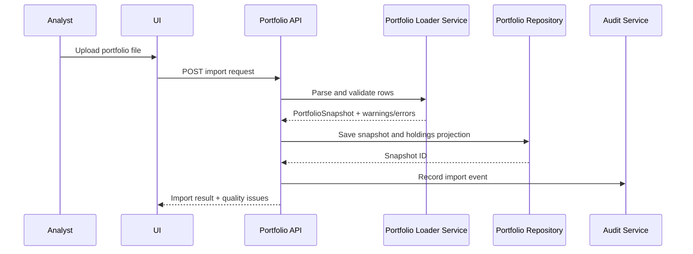
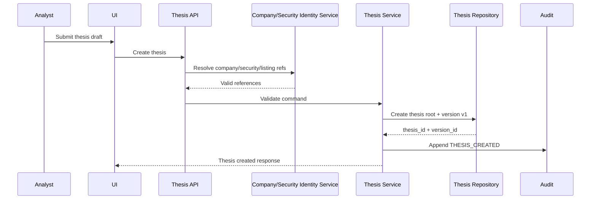
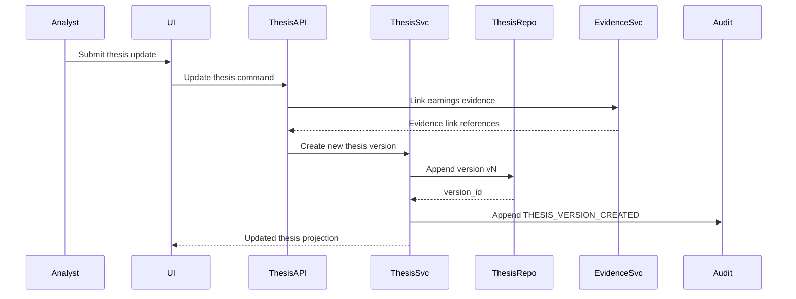
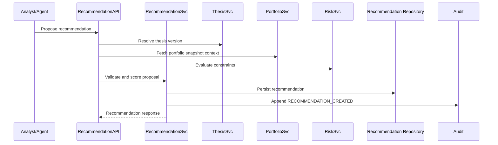
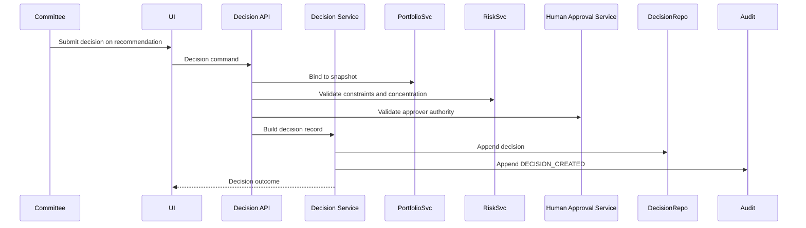
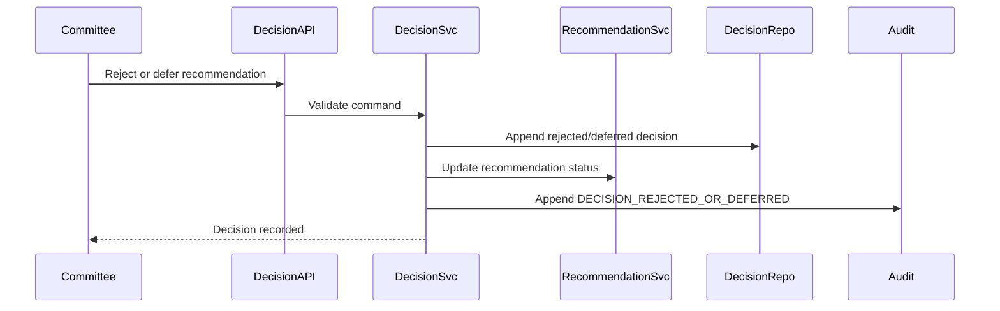
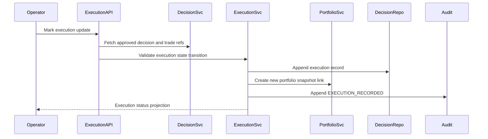
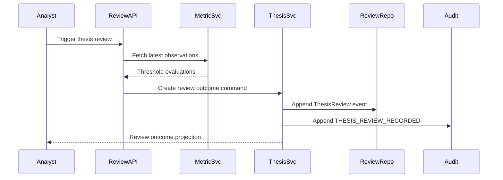
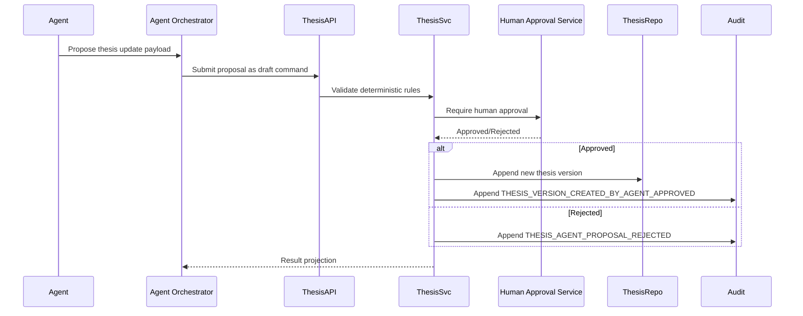

# PIIOS Sequence Diagrams

Date: 2026-07-26

## 1. Import Portfolio

## 2. Create New Thesis

## 3. Update Thesis After Earnings

## 4. Generate Recommendation

## 5. Make Investment Decision

## 6. Reject or Defer Recommendation

## 7. Execute Approved Trade

## 8. Review Thesis Using Monitoring Metrics

## 9. Agent-Proposed Thesis Update With Human Approval

## Control assertions
- Agents never write directly to repositories.
- Human approval gate is mandatory for state-changing agent proposals.
- All state changes are auditable append-only events.
