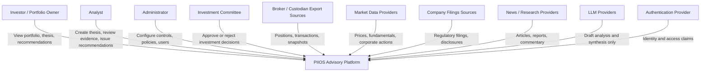

# PIIOS System Context (C4 Level 1)

Date: 2026-07-26
Purpose: define external actors and system boundaries for Wave 2A implementation.

## Scope boundary
PIIOS is an advisory-only platform. It does not execute trades and does not store broker credentials.

## Context diagram

## Boundary rules
- Humans own final investment decisions.
- Agents and models may propose but cannot mutate durable state directly.
- All durable state transitions must pass deterministic application services.
